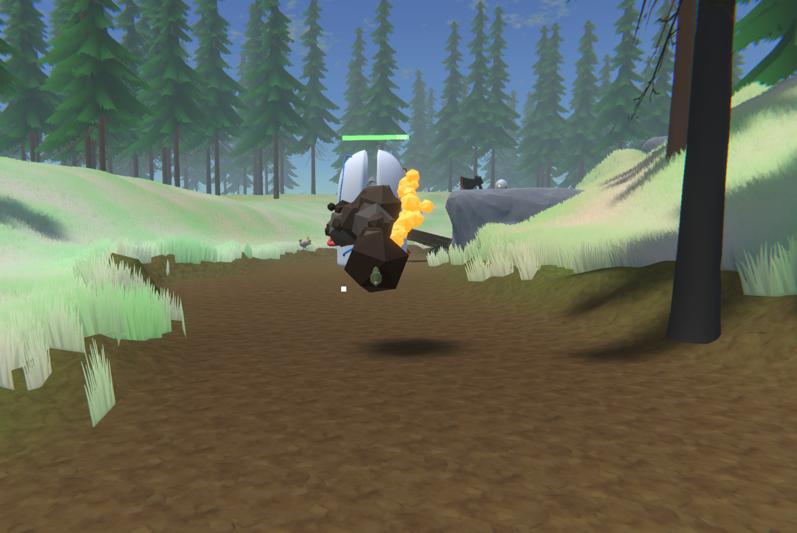
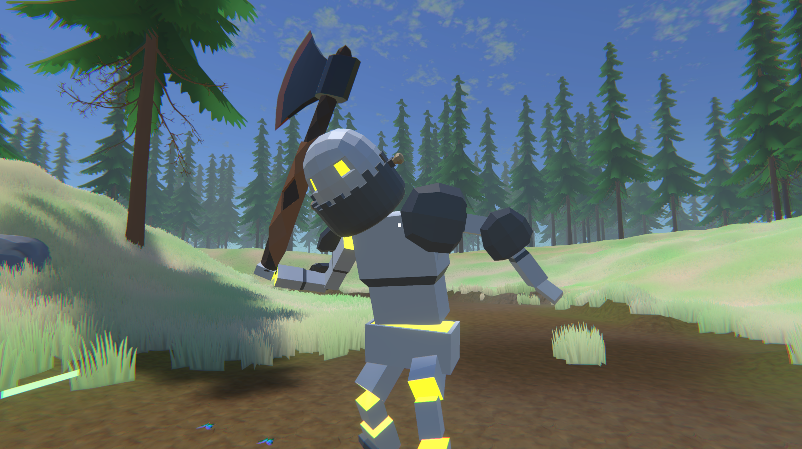
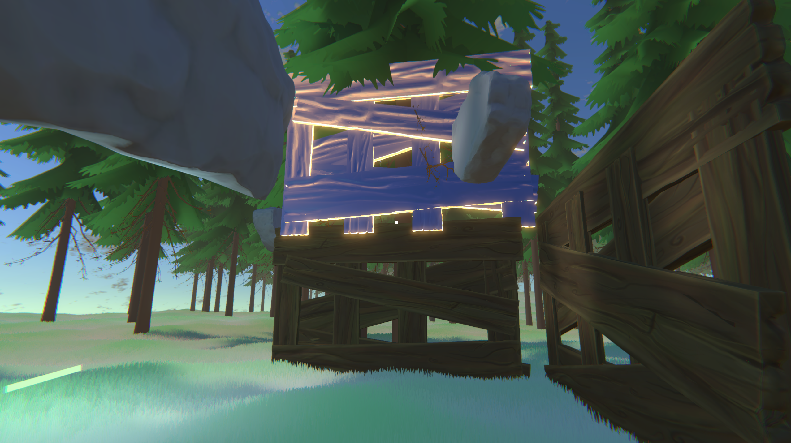

<!DOCTYPE html>
<html>
    
    
   <body>
       
     <h1 style="font-size:125px; text-align:center; color: darkslategrey; padding: 10" >NSSF</h1>
        <h3 style="font-size:50px; text-align:center; color: darkslategrey; padding: 10" >PROGRESS</h3>
        
      <iframe width="1067" height="600" src="https://www.youtube.com/embed/BzJKJXWiTEU" title="YouTube video player" frameborder="0" allow="accelerometer; autoplay; clipboard-write; encrypted-media; gyroscope; picture-in-picture" allowfullscreen></iframe>
 
       
          
        
       
       
       
    </body>

    
    
    
    
    
 
</html>
